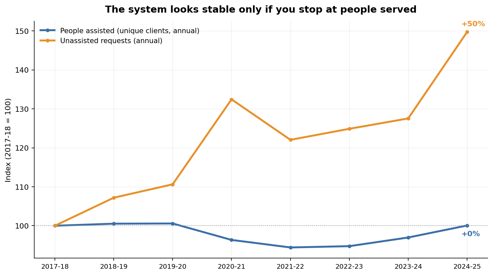

# Homelessness services in Australia: when stable client counts mask rising unmet demand

**Current Tableau Story (August 2026):**  
[Open the interactive story](https://public.tableau.com/app/profile/hayley.merat7756/viz/aihw_homeless_in_australia_review_August_2026/Story1)

**Earlier Tableau visualisation:**  
[View the previous dashboard](https://public.tableau.com/app/profile/hayley.merat7756/viz/HomelessnessinAustraliatrendsvulnerabilityanddrivers/HomelessnessinAustralia)  
Retained as an earlier version of this portfolio project. Use the current Story for the updated analysis and findings.

# Homelessness in Australia: trends, vulnerability and drivers

An analysis of nine years of Australian Institute of Health and Welfare data on specialist homelessness services, covering 2017 to 2026. It draws on two AIHW collections: monthly service data and annual client data, used together because each answers a question the other cannot.

---

## Summary

**The number of people served by homelessness services each year has barely moved since 2017. That stability is not good news — it is the finding.** Over the same period, the number of people who asked for help and were turned away rose by roughly 40%. The system has not been absorbing more people. It has been turning more of them away.


*Both series indexed to 100 at 2017-18, the first year AIHW publishes unassisted-request data.*

### Before the findings: two different counts

This analysis uses two measures of demand, and confusing them produces wrong conclusions.

| | Counts | Best for |
|---|---|---|
| **Monthly collection** | Service contacts — a person seen in three different months counts three times | Month-to-month service pressure, reasons, housing status |
| **Annual collection** | Unique people — a person seen ten times in a year counts once | How many distinct people are actually being reached |

Both are legitimate. A monthly figure rising does not necessarily mean more people; an annual figure holding flat does not necessarily mean less pressure. Each finding below states which measure it uses.

### Findings and what they mean for decision-makers

| Finding | Figure | Decision this supports |
|---|---|---|
| People served annually is essentially flat | **+0.1%**, 2017-18 to 2024-25 | Client-count KPIs alone will not reveal a system under increasing strain. Unmet demand needs to sit alongside them as a primary measure. |
| People turned away is rising sharply | **+50%** in requests; **≈+40%** adjusting for people returning more than once | This is the leading indicator of capacity pressure. It moved years before it would show up in any client-count figure. |
| The reason people seek help has shifted upstream | Housing affordability stress **+78%**; housing crisis (eviction) **+0.7%** | People are increasingly presenting before losing housing, not after. Investment in financial counselling and rent relief may now return more than investment in crisis accommodation alone. |
| The system is increasingly reaching people after they've already lost housing | Clients already homeless have outnumbered those at risk in **every month since 2023** | The system's balance has shifted from prevention toward crisis response. Worth asking whether prevention-side funding has kept pace. |
| Older Australians are a fast-growing share of clients | **+31.7%**; from 8.3% to 11.0% of all clients | Services historically designed around younger single adults and families may need to adapt to a client group with different needs. |
| Indigenous demand is growing fastest in remote Australia | Remote and very remote areas **+39.5%** per capita, against **+23.4%** in major cities | Outreach and resourcing weighted toward metropolitan service models may be structurally mismatched to where growth is concentrated. |

---

## The story

Read as a sequence, these findings describe a shift rather than a spike.

Nationally, the headline client count would tell a funding body that demand has been stable for seven years. It hasn't. Growth has shown up as people turned away rather than people served: unassisted requests up roughly 40 to 50%, and the share of all requests going unmet climbing from 23% to 31%.

That growth in pressure lines up with a change in who's arriving and when. The fastest-growing reason for seeking help is financial: affordability stress is up 78%, while actual eviction has barely moved. People are reaching services earlier in their housing crisis than they used to — but the system itself is trending the other way, with people already homeless now outnumbering people at risk in every month since 2023. More people are arriving before losing their housing; more of the system's actual contact happens after they've lost it anyway.

Two further shifts sit alongside this rather than inside it: the client base is ageing, and Indigenous demand is growing fastest in the parts of the country furthest from metropolitan services. Neither is explained by the funding-pressure story above; both are worth their own response.

**The throughline:** a system that looks steady on its most-watched metric, straining more than that metric shows, under pressure from a driver that's moving earlier in the housing-loss timeline than the service model built to catch it.

---

## Findings in detail

### 1. People served annually is flat; people turned away is not

National unique clients: 288,795 in 2017-18 to 288,970 in 2024-25, a change of +0.1%. Over the same years, unassisted requests rose from 86,103 to 128,915, +49.7%. People approach services more than once when turned away — the average rose from 1.50 to 1.60 times — so the raw request figure overstates growth in distinct people affected. Adjusting for that, growth in people turned away is closer to **+40%**. Either way, it is far larger than growth in people served. The unmet share of all requests rose from 23.0% to 30.8%: very close to a third of everyone who asks is not helped at the time.

Not all of this is permanent exclusion. Of people unassisted at some point in a year, 47.7% went on to receive some service before the year ended, up marginally from 47.1% in 2017-18. Being turned away once is common; being turned away entirely is less common.

### 2. Housing affordability stress is the fastest-growing reason people seek help

Up 77.7% since 2017 (60.7% on a smoothed basis, to account for month-to-month volatility). Housing crisis — the category covering eviction and immediate loss of accommodation — grew 0.7% over the same period. People are increasingly presenting because they cannot sustain housing they still have, not because they have already lost it.

### 3. The system is shifting from prevention to crisis response

Through 2017 to 2019, services consistently reached more people at risk of homelessness than people already homeless. That relationship inverted in 2022 and has held in every month since the start of 2023. The current gap is around 5,400 clients per month.

### 4. Accommodation remains the largest reason clients seek help, throughout

Financial reasons have grown faster than accommodation reasons (38% against 16%) but have not overtaken them in any of the 105 months in this dataset. Financial currently sits third among the four reason groups, marginally behind interpersonal reasons.

### 5. Older clients are a growing share of the system

Clients aged 55 and over rose from 8.3% to 11.0% of all clients nationally, 2017-18 to 2024-25, a 31.7% increase in absolute numbers. No comparability break affects this measure over this period.

### 6. Indigenous demand is growing fastest in remote Australia

Indigenous clients per 10,000 population rose 23.4% in major cities and 39.5% in remote and very remote areas over the same period — nearly twice the rate. This is corroborated three separate ways: the same direction and similar magnitude appears in the share of monthly service contacts (+5.9 percentage points), in unique annual clients (+27.2%), and in the population rate shown here. One caveat applies to the most recent two years specifically: consent for recording Indigenous status was removed as a requirement in October 2022, and the following year's data shows a clear one-off drop in "not stated" records consistent with that change. Growth predates the policy change by several years and continues after the one-off effect clears, so the underlying trend is real — but 2023-24 and 2024-25 growth is likely somewhat inflated by improved recording rather than solely by more people presenting.

---

## A note on state comparisons

An earlier version of this analysis compared states directly — for example, Queensland's client numbers rising faster than any other state. That comparison has been retired as a headline finding.

AIHW's own technical documentation names a distinct data or service-model issue for every jurisdiction in this collection. Victoria's falling client numbers substantially reflect a deliberate, ongoing shift of family violence intake to a service outside this collection, not falling need. Queensland's rise is partly attributable to a funding increase and a referral platform that affects how unassisted requests are recorded. South Australia's system is stated by AIHW to understate unmet need by design. Every other state carries a comparable note.

State-level unmet-need rates are still reported below, because they are the clearest available signal of where a system is under the most pressure, but they should be read as directional, not as a precise ranking:

| State | 2017-18 | 2024-25 | Caveat |
|---|---|---|---|
| Tasmania | 61.4% | 64.4% | Data suppressed in places; service model changed in 2024-25 |
| Western Australia | 46.6% | 57.6% | No jurisdiction-specific caveat identified |
| Northern Territory | 36.8% | 50.2% | Major new agency began reporting in 2019 |
| New South Wales | 13.8% | 24.1% | 2014-15 service transition affects early-period data |
| Victoria | 21.8% | 24.0% | See above |
| Queensland | 10.2% | 22.4% | See above |
| Australian Capital Territory | 10.5% | 7.5% | Only jurisdiction where the rate fell |
| South Australia | 1.7% | 5.0% | Understated by design (AIHW's own assessment) |

National, and Tasmania and Western Australia's persistently high rates specifically, are the figures I'd place the most weight on. A precise ranking across all eight is not something this collection reliably supports.

---

## Methodology note

### Counting rules in the monthly collection

A client may report more than one reason for seeking assistance, so reason categories cannot be summed to a total — AIHW states this directly in the collection's explanatory notes. In March 2026, individual reason records total 291,804 against 100,421 actual clients, roughly 2.9 reasons per client.

AIHW publishes both individual reasons and an unduplicated total for each reason group, one row per group where the reason name is the group's own total. This analysis uses the unduplicated totals for every group-level figure. Summing sub-reasons instead inflates each group in proportion to how many sub-categories it contains — for March 2026, a factor of 1.74 for Financial across five reasons against 1.38 for Accommodation across three. Identifying the total rows required care: the rule that the reason name matches the group name holds for most groups and fails silently for others (Interpersonal's total is labelled "Interpersonal Relationships"; the collection total is "Total Clients"). The notebook validates the mapping against an invariant — a group total can never be smaller than its largest single reason nor larger than the sum of all of them — rather than trusting the name match alone.

Growth is reported on two bases throughout: point-to-point (first month against last) and a twelve-month average (first year against last year, which smooths single-month volatility). Both appear because the difference is sometimes the point. The Northern Territory's monthly client count looks like the second-fastest-growing jurisdiction on point-to-point figures and a middling one on smoothed figures — a small base is sensitive to whichever months happen to sit at either end.

**Data from July 2025 onward are preliminary** and may be revised. Every finding was re-run excluding those months; none changed direction or materially in size (see the notebook for the full comparison).

### Counting rules in the annual collection

The annual collection deduplicates clients within each financial year using a statistical linkage key, so a person with several support periods in a year is counted once. Data quality is not uniform across all measures in the annual collection: unassisted requests carry a specific limitation, since the same linkage key was missing for 45 to 48% of unassisted requests in a given year, which is why AIHW reports the figure as request volume rather than a precise person count, and why this analysis reports an approach-adjusted range alongside the raw figure rather than treating either as exact.

### Data source and licence

Two AIHW collections, both released under a [Creative Commons BY 4.0 licence](https://creativecommons.org/licenses/by/4.0/):

- *Specialist Homelessness Services: monthly data*, cat. no. HOU 321, snapshot 7 May 2026.
- *Specialist Homelessness Services: historical tables 2011-12 to 2024-25*, cat. no. HOU 343.

Attributed per the [AIHW attribution policy](https://www.aihw.gov.au/copyright): source data redistributed unmodified in `data/` as "Source: Australian Institute of Health and Welfare"; charts and analysis in this repository as "Based on Australian Institute of Health and Welfare material." AIHW does not endorse this analysis or any conclusion drawn from it. Interpretation and any error are mine.

---

## What this analysis cannot answer

**Whether affordability stress precedes or follows housing loss.** Reason for seeking assistance and homeless status are published in separate tables with no cross-tabulation. Concluding that affordability stress is progressing to homelessness would require unit record data or the SHSC data cubes, which may permit this specific cross-tabulation.

**Why Victoria's client numbers moved as they did, precisely.** AIHW attributes it substantially to a deliberate policy shift (family violence intake moving to a non-SHS service) rather than to underlying need, but the exact split between that and other factors isn't quantifiable from published tables alone.

**Whether the client characteristic findings agree across collections.** Indigenous status agrees closely across three independent measures (see Finding 6). Family and domestic violence does not: the monthly share of clients rises (+5.4% relative) while the annual unique-client count falls (-3.8%). No explanation for this disagreement is available from the published tables, and it is flagged rather than resolved.

**Whether rising recorded demand reflects more need or more contact per person.** This was tested directly: support periods per unique client fell slightly nationally (-4.1%, 2017-18 to 2024-25) and in every state examined, ruling out "people returning more often" as the explanation for any gap between monthly and annual trends. The remaining gap between monthly service-contact growth and annual unique-client growth (flat) is not explained by this data and would need further investigation.

**Whether growth in recorded demand means growth in homelessness in the population.** This collection counts people who sought and received assistance from a funded agency. It does not count people who never approached a service, and it undercounts people turned away without a full record. Every finding here describes the service system, not the size of the underlying problem. The ABS Census, which takes a population snapshot independent of service contact, is a different and complementary measure.

---

## Repo structure

```
homelessness-australia-analysis/
├── README.md
├── homelessness_analysis.ipynb      ← run this
├── requirements.txt
├── data/
│   ├── aihw-hou-321-SHS-data-tables_March-2026.xlsx
│   └── AIHW-HOU-343-Specialist-homelessness-services-historical-tables-2011-12-to-2024-25.xlsx
└── outputs/
    ├── chart_A_state_growth.png
    ├── chart_B_reason_growth.png
    ├── chart_C_reason_groups.png
    ├── chart_D_homeless_vs_atrisk.png
    ├── chart_E_demand_vs_unmet.png
    ├── shs_clients_trend.csv
    ├── shs_reasons.csv
    ├── shs_client_groups.csv
    ├── hist_national_demand.csv
    ├── hist_state_unmet_rate.csv
    ├── hist_older_clients.csv
    └── hist_indigenous_by_remoteness.csv
```

Every CSV is annotated with its counting basis, either in the filename (`hist_` prefix for the annual collection) or in a column (`record_type` in `shs_reasons.csv`), so the two collections cannot be silently combined in a chart without the person building it knowing which measure they're using.

## How to run

```bash
pip install -r requirements.txt
jupyter notebook homelessness_analysis.ipynb   # then Run All
```

Runs end to end in under two minutes and regenerates every chart, CSV, and validation check. Four assertions confirm the historical-workbook figures on every run; if a future AIHW release changes the underlying numbers, the notebook will fail loudly at the relevant cell rather than silently producing an outdated chart.

## Tools

`Python 3` · `pandas` · `matplotlib` · `openpyxl` · `Tableau Public`
